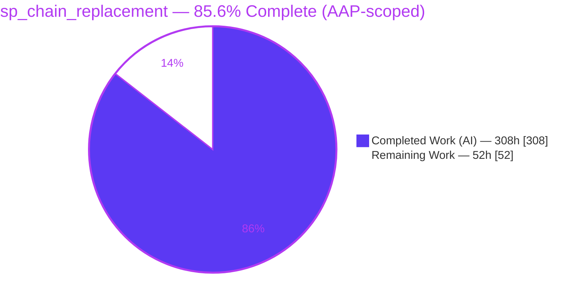
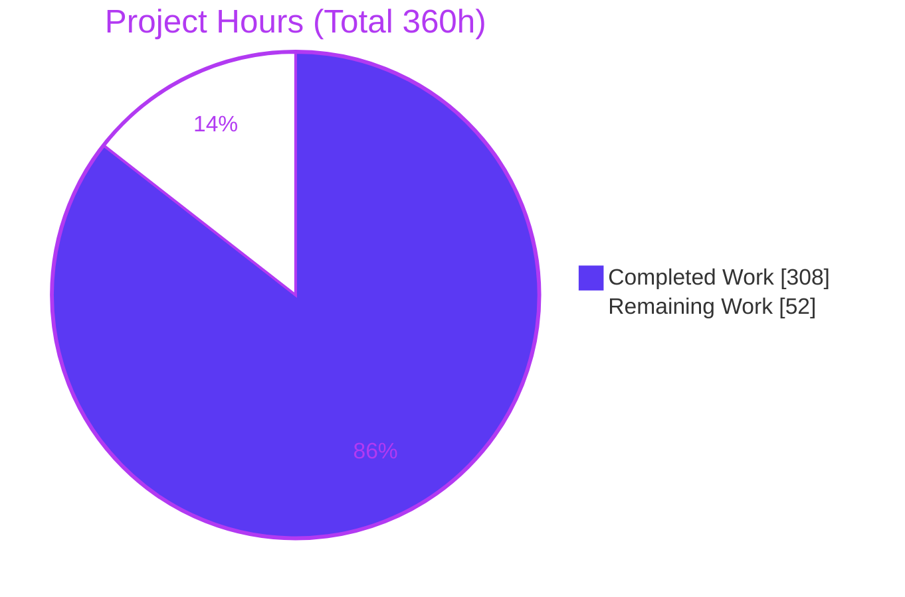
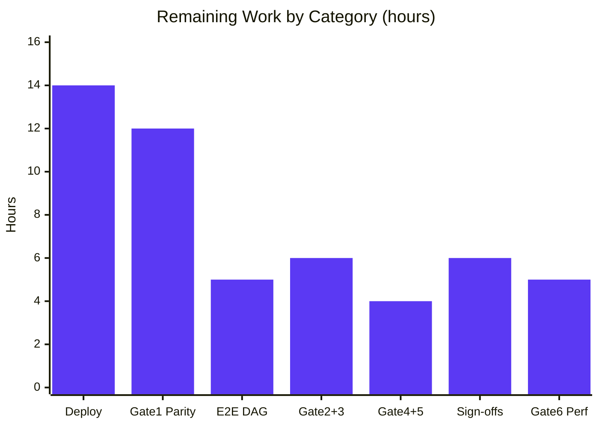

<!--
Blitzy Project Guide — sp_chain_replacement (Delta Lake on AWS Glue 4.0 ETL)
Brand palette: Completed/AI = Dark Blue #5B39F3 · Remaining = White #FFFFFF
               Headings/Accents = Violet-Black #B23AF2 · Highlight = Mint #A8FDD9
All hour figures are AAP-scoped (PA1): 308 completed / 52 remaining / 360 total = 85.6%.
-->

# Blitzy Project Guide — `sp_chain_replacement`
### Delta Lake on AWS Glue 4.0 / PySpark ETL Pipeline

> **AAP-scoped completion: 85.6%** &nbsp;·&nbsp; **308 h** completed (AI) &nbsp;·&nbsp; **52 h** remaining (path‑to‑production) &nbsp;·&nbsp; **360 h** total
> Branch `blitzy-10c284ae-ed37-4df6-af88-3d79eaf8789a` &nbsp;·&nbsp; HEAD `76e85f1b3` &nbsp;·&nbsp; Working tree **CLEAN**

---

## 1. Executive Summary

### 1.1 Project Overview

This project delivers a net‑new, configuration‑driven, multi‑stage **AWS Glue 4.0 (PySpark / Apache Spark 3.3.x, Python 3.10)** ETL pipeline that writes to **Delta Lake** tables on Amazon S3 with full ACID guarantees via the `io.delta.storage.S3DynamoDBLogStore`, replacing — on a strict **1:1 functional‑parity basis** — a legacy Informatica‑orchestrated SQL Server stored‑procedure chain. The workload (`sp_chain_replacement`, finance domain) is a purely **additive** feature layered onto the `delta-io/delta` monorepo: it *consumes* published Delta artifacts and touches **zero** existing repository source. Target users are the finance data‑engineering team; business impact is a governed, idempotent, cloud‑native replacement for a brittle legacy chain with ≥ 99.99% output parity.

### 1.2 Completion Status

The completion percentage is computed with the AAP‑scoped hours methodology `Completed ÷ (Completed + Remaining)`. The entire autonomous code build is complete and internally validated; the remaining work is **path‑to‑production** (live AWS deployment, gate execution against real data + client baseline, and platform/client sign‑off on documented open items).



| Metric | Value |
|---|---|
| **Total Hours** | **360 h** |
| **Completed Hours (AI + Manual)** | **308 h** (AI: 308 h · Manual: 0 h) |
| **Remaining Hours** | **52 h** |
| **Percent Complete** | **85.6 %** |

> Color key — <span style="color:#5B39F3">■</span> **Completed (Dark Blue `#5B39F3`)** · <span style="color:#B23AF2">□</span> **Remaining (White `#FFFFFF`)**

### 1.3 Key Accomplishments

- ✅ **All 8 net‑new feature directories delivered** — `jobs/`, `lib/`, `schemas/`, `dags/`, `config/`, `infra/`, `validate/`, `artifacts/` — as **47 additive files (+10,702 LOC)** across **35** agent commits, with **zero** existing files modified (Minimal Change Mandate held).
- ✅ **ACID Spark wiring complete** — `lib/spark_session.py` sets all six canonical properties: `spark.sql.extensions=io.delta.sql.DeltaSparkSessionExtension`, `spark.sql.catalog.spark_catalog=org.apache.spark.sql.delta.catalog.DeltaCatalog`, **both** `spark.delta.logStore.s3.impl` **and** `spark.delta.logStore.s3a.impl` = `io.delta.storage.S3DynamoDBLogStore`, plus DynamoDB `ddb.tableName`/`ddb.region`.
- ✅ **1:1 stored‑procedure chain replicated** — Stage 0 ingest + three transform stages (`cleanse_transactions` → `enrich_accounts` → `compute_balances`) + Stage N output, driven by the authoritative `config/pipeline_manifest.yaml` (5 stages, 6 Delta tables).
- ✅ **Schema safety enforced** — explicit `StructType` definitions in `schemas/`; `mergeSchema=false` on every write path in `lib/delta_io.py`; schema inference prohibited.
- ✅ **Least‑privilege IaC** — Terraform provisions Glue jobs, IAM role/policy (zero wildcard resource ARNs), the DynamoDB coordination table (`tablePath` HASH / `fileName` RANGE, TTL on `expireTime`), and S3 uploads; all resources carry the five mandatory tags (`ManagedBy="terraform"`). `terraform validate` = *Success*; `terraform fmt` clean.
- ✅ **Delta ↔ Glue compatibility RESOLVED** — pinned **`delta-spark==2.3.0` + `pyspark` 3.3.x** (the latest Delta line compatible with Glue 4.0's Spark 3.3.x), superseding the incompatible 3.2.0 pin; connector JAR renamed to `delta-core_2.12-2.3.0.jar`; zero logic change to jobs/lib/schemas/dags.
- ✅ **Empirical local validation** — 11/11 Spark + Delta smoke test (run twice), 12/12 module imports, `compileall` exit 0, and all four staged Delta 2.3.0 binaries SHA‑256‑verified against `artifacts/README.md`.

### 1.4 Critical Unresolved Issues

| Issue | Impact | Owner | ETA |
|---|---|---|---|
| ACID commit path (`S3DynamoDBLogStore`) not yet exercised against **live** DynamoDB | Core ACID guarantee proven only against local `file://` in smoke; multi‑cluster conditional‑write must be confirmed on first deploy (Gate 2) | Data Eng / DevOps | Within Gate 2 (H12) |
| 1:1 functional **parity** unproven vs real SQL Server baseline | Business acceptance (≥ 99.99% row‑count + 5‑field‑hash for 100% of tables) cannot close until the client baseline is loaded and Gate 1 is run | Data Eng + Client | Within Gate 1 (H7–H9) |
| Full pipeline never executed **end‑to‑end** on live AWS | MWAA `GlueJobOperator` chain, retry/failure‑recovery, and CloudWatch emission are unobserved on a real account | Data Eng / DevOps | Within H10–H11 |

> The Delta↔Glue Spark‑version tension (previously the top open item) is **RESOLVED** and is no longer a blocker (see §1.3, §5, §6 risk T1).

### 1.5 Access Issues

| System / Resource | Type of Access | Issue Description | Resolution Status | Owner |
|---|---|---|---|---|
| AWS account (Glue, S3, DynamoDB, IAM, CloudWatch) | Deploy/runtime credentials | No credentials available to the autonomous agent; `terraform apply` and all live gates require them | Open — required for deployment | DevOps / Platform |
| Amazon MWAA environment | Pre‑provisioned env + DAG bucket | Environment is external/pre‑provisioned; DAG delivery + trigger need account access | Open — external prerequisite | Platform |
| Pre‑existing S3 buckets (`DELTA`, `ARTIFACT`, `MWAA_DAG`, source) | Bucket existence + write | Assumed present per AAP; must be confirmed before apply | Open — confirm existence | Platform |
| Legacy SQL Server / Informatica baseline | Read‑only sampled extract | Client‑supplied parity baseline not yet provided | Open — client input | Client + Data Eng |

### 1.6 Recommended Next Steps

1. **[High]** Provision credentials + confirm prerequisites (MWAA env, four S3 buckets), then `terraform init -backend-config=envs/<env>-backend.hcl` and `apply` to **dev** (H1–H3).
2. **[High]** Obtain and load the sampled legacy SQL Server baseline; trigger a full pipeline run to populate all six Delta tables (H7–H8).
3. **[High]** Execute **Gate 1** parity (`pytest validate/test_parity.py --env dev`) and reconcile ≥ 99.99% across all six tables; validate the end‑to‑end MWAA DAG chain (H9–H11).
4. **[Medium]** Execute **Gates 2–5** on the live environment (ACID conditional‑write via CloudWatch, idempotency double‑run diff, infra‑drift zero‑change + 5‑tag check, `simulate-principal-policy`) (H12–H15).
5. **[Medium/Low]** Close open items with the platform team (MWAA naming, secrets management) and the client (Informatica SLA → **Gate 6** benchmark) (H16–H19).

> ℹ️ **Compatibility note (RESOLVED):** the Delta 3.2.0 ↔ Glue 4.0 tension raised in AAP §0.3.3 is closed — the codebase is pinned to `delta-spark==2.3.0`/`pyspark` 3.3.x and empirically validated. No version action remains.

---

## 2. Project Hours Breakdown

### 2.1 Completed Work Detail

All completed work was performed autonomously by Blitzy agents (**0 human/manual hours**). Each component traces to an AAP §0.5.1 deliverable group.

| Component | Hours | Description |
|---|---:|---|
| Shared ACID library (`lib/`, 9 files, 2,472 LOC) | 84 | `spark_session` (6 canonical Delta/LogStore props), `delta_io` (`mergeSchema=false`), `schema_validation`, `manifest`, `source_contract`, `logging_utils` (6‑field CloudWatch event), `job_args`, `s3_paths`, `__init__`. |
| Stage 0 ingestion job (`jobs/stage_0_ingest.py`) | 22 | Delimited‑file read per source contract, `StructType` validation, bad‑record quarantine + count, fail‑fast non‑zero over threshold, CWE‑22 path safety, `staging_raw` overwrite. |
| Stage 1–3 transformation jobs (1:1 SP replication) | 54 | `cleanse_transactions`, `enrich_accounts`, `compute_balances` — one PySpark transform per stored procedure; read prior Delta table → write next `staging_*` overwrite. |
| Stage N output job (`jobs/stage_n_output.py`, 640 LOC) | 22 | Final output tables with per‑table mode — `fact_general_ledger` (merge upsert) and `dim_account_snapshot` (overwrite). |
| Explicit schema definitions (`schemas/`, 805 LOC) | 14 | `staging_raw`, `staging_tables`, `output_tables` — explicit `StructType` for every table. |
| Config manifest + source contract (`config/`) | 10 | `pipeline_manifest.yaml` (authoritative SP→job map, stage order, write modes, merge conditions, parity blocks) + `sp_chain_replacement_source_contract.yaml`. |
| MWAA DAG orchestration (`dags/`) | 12 | `sp_chain_replacement_dag.py` — one `GlueJobOperator` per stage chained sequentially with `>>`; cron + manual trigger. |
| Terraform IaC (`infra/`, 9 `.tf` + envs/backends) | 46 | `versions`/`providers`/`variables`/`locals`/`glue_jobs`/`iam`/`dynamodb`/`s3_objects`/`outputs` + dev/nonprod/prod `.tfvars` + per‑env `-backend.hcl`; least‑privilege IAM, 5 mandatory tags. |
| Parity + security validation harness (`validate/`, 1,515 LOC) | 28 | `conftest` (`--env` option, baseline loader), `test_parity` (Gate 1 parity + Gate 5 security), `reconciliation`, `requirements.txt`. |
| Staged Delta artifacts + provenance (`artifacts/`) | 8 | Three Delta 2.3.0 JARs + wheel + `README.md` (Maven `.sha1` reconciliation, SHA‑256 table, class‑closure proof). |
| Delta ↔ Glue compatibility resolution (Refine PR) | 8 | Version research + citation, `.venv` rebuild, 2.3.0 re‑pin across artifacts/infra/validate/docs, 11/11 smoke re‑verification. |
| **Total Completed** | **308** | |

### 2.2 Remaining Work Detail

Every remaining item is **path‑to‑production**: it requires live AWS, client input, or platform sign‑off that is outside the autonomous agent's scope.

| Category | Hours | Priority |
|---|---:|---|
| Live AWS deployment (`terraform init`+`apply` dev/nonprod/prod, artifact + DAG upload) | 14 | High |
| Gate 1 parity execution vs client SQL Server baseline (6 tables, ≥ 99.99%) | 12 | High |
| End‑to‑end MWAA DAG runtime validation (trigger / monitor / troubleshoot) | 5 | High |
| Gate 2 ACID + Gate 3 idempotency verification on live environment | 6 | Medium |
| Gate 4 infra‑drift + Gate 5 security live verification | 4 | Medium |
| Open‑item sign‑offs: MWAA naming + secrets management (platform team) | 6 | Medium |
| Gate 6 performance: Informatica SLA acquisition + live benchmark | 5 | Low |
| **Total Remaining** | **52** | |

### 2.3 Reconciliation (cross‑section integrity)

| Check | Value | Status |
|---|---|---|
| Section 2.1 Completed | 308 h | ✓ |
| Section 2.2 Remaining | 52 h | ✓ |
| **2.1 + 2.2 = Total (Section 1.2)** | **360 h** | ✓ |
| Remaining matches Section 1.2 / Section 7 | 52 h | ✓ |
| Completion = 308 ÷ 360 | **85.6 %** | ✓ |

---

## 3. Test Results

All tests below originate from **Blitzy's autonomous validation logs** for this project and were re‑verified during this assessment. Local execution used the rebuilt `.venv` (CPython 3.10.20, `pyspark` 3.3.4, `delta-spark` 2.3.0) with the three staged Delta 2.3.0 JARs on the driver classpath.

| Test Category | Framework | Total Tests | Passed | Failed | Coverage / Scope | Notes |
|---|---|---:|---:|---:|---|---|
| Spark + Delta functional smoke | PySpark 3.3.4 + delta‑spark 2.3.0 | 11 | 11 | 0 | LogStore config, schema validation, overwrite round‑trip + idempotency, merge create/upsert/idempotency, bad‑record routing, threshold fail‑fast | Run **twice**, exit 0 both times |
| Module import checks | Python `importlib` | 12 | 12 | 0 | `lib` (8) + `schemas` (3) + `validate` (1); `jobs.stage_0_ingest` also imports | 0 import errors |
| Static compilation | `compileall` / `py_compile` | 23 py files | 23 | 0 | `jobs`, `lib`, `schemas`, `validate` (+ `dags` via `py_compile`) | exit 0 |
| IaC validation | Terraform 1.9.8 | 9 `.tf` modules | pass | 0 | HCL syntax + provider schema (`aws` 5.100.0) | `Success!`; `fmt -check` clean |
| Dependency resolution | `uv pip check` | all packages | pass | 0 | pyspark 3.3.4 ↔ delta‑spark 2.3.0 compatibility | zero resolution errors |
| Gate 1 — Parity (integration) | `pytest` + `boto3` | — | — | — | 6 tables ≥ 99.99% row‑count + 5‑field‑hash | **Pending** — SKIPs by design without deployed env + client baseline |
| Gate 5 — Security (integration) | `pytest` + `boto3` IAM | — | — | — | `simulate-principal-policy` on deployed role | **Pending** — static no‑wildcard check already PASS |

**Summary:** 46 runnable local checks executed, **46 passed / 0 failed**. The two integration gates (parity, security‑live) are correctly *pending* — they are AWS‑integration tests that skip cleanly without a deployed environment and client baseline (0 failures, not skipped‑due‑to‑error).

> **Caveat (honest scope):** local smoke exercises the Delta API surface, config wiring, and schema/overwrite/merge/bad‑record semantics over `file://`. `S3DynamoDBLogStore` is on the classpath and wired for `s3`/`s3a` but is **not** live‑invoked locally (requires deployed AWS).

---

## 4. Runtime Validation & UI Verification

This is a **headless, server‑side data‑engineering pipeline** — there is **no user interface**, component library, or design surface (AAP §0.5.3). Operator interaction is exclusively via the Airflow scheduler/trigger and CloudWatch logs. Runtime validation below reflects locally‑runnable surfaces plus items pending a live environment.

- ✅ **Operational — SparkSession bootstrap:** `build_spark_session()` constructs a `pyspark` 3.3.4 session with all six canonical Delta/LogStore properties present (verified in smoke step 2).
- ✅ **Operational — Schema validation & bad‑record routing:** raises on missing required column; routes malformed rows to a parquet quarantine; enforces the bad‑record threshold with fail‑fast (smoke steps 3, 9–11).
- ✅ **Operational — Delta write semantics:** overwrite round‑trip + idempotency, merge create/upsert/preserve + idempotency all pass locally (smoke steps 4–8).
- ✅ **Operational — Module imports & IaC:** 12/12 imports; `terraform validate` = *Success*; `terraform fmt` clean.
- ⚠ **Partial — MWAA DAG:** `py_compile` passes; local *import* intentionally fails only on the MWAA‑provided runtime dependency `pendulum` (dags/ untouched). Full DAG parse/parse‑time validation occurs in the MWAA environment.
- ❌ **Failing/Pending (live‑only) — ACID conditional writes (Gate 2):** requires deployed DynamoDB; not invoked locally.
- ❌ **Failing/Pending (live‑only) — End‑to‑end pipeline & CloudWatch emission:** requires deployed Glue + MWAA + S3.
- ❌ **Failing/Pending (live‑only) — Parity (Gate 1) & IAM `simulate-principal-policy` (Gate 5):** require deployed resources + client baseline.

---

## 5. Compliance & Quality Review

AAP deliverables and mandated conventions cross‑mapped to their quality/compliance benchmarks. "Fixes applied" reflect work performed during autonomous validation/refine.

| Benchmark / Convention (AAP) | Status | Evidence / Fixes Applied |
|---|---|---|
| **Minimal Change Mandate** — zero edits to existing repo | ✅ Pass | `git` name‑status = 47 `A`, 0 `M`/`D`; all work under the 8 net‑new dirs. |
| **LogStore enforcement** — `S3DynamoDBLogStore` only, both `s3`/`s3a` impl | ✅ Pass | `lib/spark_session.py` sets both impl keys + extension/catalog + ddb table/region. |
| **Schema safety** — explicit `StructType`, `mergeSchema=false` | ✅ Pass | `schemas/*` explicit types; `lib/delta_io.py` unconditionally sets `mergeSchema=false`. |
| **Least‑privilege IAM** — no `*` resource ARNs | ✅ Pass (static) | `infra/iam.tf` scopes every statement to specific ARNs; 0 bare `Resource:"*"`. Live `simulate-principal-policy` = Gate 5 (pending). |
| **Mandatory tagging** — 5 tags, `ManagedBy="terraform"` | ✅ Pass | `infra/locals.tf` `common_tags`; live drift/tag check = Gate 4 (pending). |
| **Runtime pin** — Glue 4.0 (Spark 3.3.x, Python 3.10) | ✅ Pass | `infra/glue_jobs.tf` `glue_version="4.0"` hardcoded. |
| **Artifact sourcing** — Delta from `ARTIFACT_S3_BUCKET` only | ✅ Pass | `infra/s3_objects.tf` uploads 3 JARs + wheel; Glue `--extra-jars`/`--additional-python-modules` reference S3 URIs; public PyPI/Maven prohibited. |
| **ACID strictness** — conditional‑write failure ⇒ non‑zero, no fallback | ✅ Pass (code) | No fallback path in `lib/delta_io.py`/jobs; live proof = Gate 2 (pending). |
| **Delta ↔ Spark compatibility** (AAP §0.3.3) | ✅ Resolved | Pinned `delta-spark==2.3.0`/`pyspark` 3.3.x; wheel‑METADATA + compatibility‑matrix citation; 11/11 smoke. |
| **Idempotency** — re‑run yields identical output | ✅ Pass (local) | overwrite/merge design; smoke steps 5 & 8; live double‑run diff = Gate 3 (pending). |
| **1:1 SP parity** (business acceptance ≥ 99.99%) | ⏳ Pending | Transform code complete; requires Gate 1 vs client baseline. |

**Outstanding compliance items:** live execution of Gates 1–6, and platform/client sign‑off on the documented open items (MWAA naming, secrets management, Informatica SLA).

---

## 6. Risk Assessment

**3 High‑severity risks remain**, all of the "unproven‑until‑live" verification class — none are in‑scope code defects.

| Risk | Category | Severity | Probability | Mitigation | Status |
|---|---|---|---|---|---|
| ACID commit path not exercised against live DynamoDB | Technical | High | Medium | Gate 2 CloudWatch conditional‑write metric on first deploy | Open |
| 1:1 SP functional parity unproven vs real baseline | Technical | High | Medium | Run built Gate 1 harness vs client SQL Server extract | Open |
| Full pipeline never run end‑to‑end on live AWS (MWAA + Glue) | Operational | High | Medium | End‑to‑end nonprod DAG validation (H10–H11) | Open |
| Delta ↔ Glue Spark‑version compatibility | Technical | Low (was High) | Low | Pinned Delta 2.3.0 / pyspark 3.3.x; empirical 11/11 smoke + citation | **Resolved** |
| IAM `simulate-principal-policy` not run on deployed role | Security | Medium | Low | Gate 5 live assertion post‑deploy (static no‑wildcard already PASS) | Open |
| Secrets‑management approach unconfirmed | Security | Medium | Medium | Platform sign‑off; assume role‑assumption/param lookup, no secrets in code/`.tfvars` | Open |
| CloudWatch 6‑field logging unobserved live; no alarms | Operational | Medium | Medium | Verify emission on first dev run; add CloudWatch alarms | Open |
| Gate 6 performance vs Informatica SLA unknown | Operational | Low | Medium | Acquire SLA; benchmark ≤ 2× before cutover (non‑blocking initially) | Open |
| Glue 4.0 runtime vs local pyspark 3.3.4 patch drift | Technical | Low | Low | Dev‑env Glue smoke before prod | Open |
| MWAA task‑naming pattern assumption unconfirmed | Integration | Low | Medium | Platform confirm `{env}-{domain}-{pipeline}-{step}` | Open |
| AWS service boundaries untested end‑to‑end on real account | Integration | Medium | Medium | Dev deploy + smoke (subsumed by end‑to‑end validation) | Open |
| Pre‑existing prerequisites (MWAA env, 4 buckets) assumed present | Integration | Medium | Low | Confirm with platform team before `apply` | Open |

---

## 7. Visual Project Status



**Remaining hours by category (Section 2.2 — total 52 h):**



> Color key — <span style="color:#5B39F3">■</span> **Completed (Dark Blue `#5B39F3`)** · <span style="color:#B23AF2">□</span> **Remaining (White `#FFFFFF`)**. "Remaining Work" = **52 h**, matching Section 1.2 and the sum of Section 2.2.

**Priority distribution of remaining work:** High **31 h** · Medium **16 h** · Low **5 h** (= 52 h).

---

## 8. Summary & Recommendations

**Achievements.** The `sp_chain_replacement` pipeline is **85.6% complete** on an AAP‑scoped basis (**308 of 360 hours**). Every AAP §0.5.1 deliverable — Glue jobs (Stage 0 ingest, three 1:1 SP transforms, Stage N output), the shared ACID library, explicit schemas, the MWAA DAG, the config manifest, least‑privilege Terraform IaC, the parity/security harness, and the staged Delta artifacts — is implemented across **47 additive files (+10,702 LOC)**, compiles, imports, and passes a live local Spark + Delta smoke suite (11/11, run twice), 12/12 imports, and `terraform validate`. The **Minimal Change Mandate** is fully respected (0 existing files touched), and the **Delta ↔ Glue Spark‑version open item is definitively resolved** (Delta 2.3.0 / pyspark 3.3.x).

**Remaining gaps & critical path.** The outstanding **52 hours** are exclusively **path‑to‑production** and cannot be closed autonomously: (1) live AWS deployment, (2) loading the client SQL Server baseline and running **Gate 1** parity, (3) end‑to‑end MWAA/Glue execution, then (4) **Gates 2–5** on the live environment and (5) platform/client sign‑off on the remaining open items (MWAA naming, secrets management, Informatica SLA → Gate 6). The critical path runs Deploy‑to‑dev → populate tables → Gate 1 parity → end‑to‑end DAG → Gates 2–5 → prod cutover.

**Success metrics.** Production readiness is reached when: Gate 1 parity ≥ 99.99% for 100% of tables; Gate 2 shows ≥ 1 DynamoDB conditional write per commit; Gate 3 double‑run shows no row growth; Gate 4 reports zero drift with all 5 tags; Gate 5 `simulate-principal-policy` passes; and Gate 6 wall‑clock ≤ 2× the Informatica SLA.

**Production readiness assessment.** **Not yet production‑ready**, but **code‑complete and internally validated**. Confidence is **High** for the code build (well‑defined AAP, all constraints met, empirically smoke‑tested) and **Medium** for the path‑to‑production estimate (dependent on external AWS access, client baseline, and platform sign‑off). No in‑scope code defects were identified.

| Metric | Value |
|---|---|
| AAP‑scoped completion | 85.6 % |
| Completed / Total hours | 308 / 360 |
| Remaining hours | 52 |
| High‑severity risks | 3 (all live‑verification) |
| In‑scope code defects | 0 |

---

## 9. Development Guide

All commands below were tested during this assessment from the repository root. Paths are relative to the repo root unless noted.

### 9.1 System Prerequisites

- **OS:** Linux (validated on Ubuntu 25.10) or macOS for local development.
- **Python 3.10** — matches the Glue 4.0 Python runtime (assessment `.venv` = CPython 3.10.20).
- **Java 11** — required by Apache Spark 3.3.x (validated `openjdk 11.0.31`).
- **Terraform ≥ 1.5** (validated `1.9.8`) + the `hashicorp/aws` 5.x provider.
- **AWS CLI + credentials** — for deployment and live gates only.
- **Hardware:** ≥ 4 vCPU / 8 GB RAM for local Spark smoke.

### 9.2 Environment Setup

```bash
# From the repository root
python3.10 -m venv .venv          # or: uv venv --python 3.10
source .venv/bin/activate
export JAVA_HOME=/path/to/java-11 # ensure Spark uses Java 11
```

> **Note:** a `uv`‑created venv is pip‑less — use `uv pip list` or `python -c "import importlib.metadata"` to inspect versions, not bare `pip list`.

### 9.3 Dependency Installation

```bash
pip install -r validate/requirements.txt
# Pins: delta-spark==2.3.0 · pyspark>=3.3.0,<3.4.0 · pytest>=7.0.0 · boto3>=1.26.0 · pyyaml>=6.0
```

Expected resolution: `pyspark 3.3.4`, `delta-spark 2.3.0`, `py4j 0.10.9.5`, `boto3 1.43.x`, `pytest 9.x`, `PyYAML 6.0.x`.

### 9.4 Local Verification (no AWS required)

```bash
# 1) Compile all Python
python -m compileall -q jobs lib schemas validate    # expect: exit 0
python -m py_compile dags/sp_chain_replacement_dag.py # expect: exit 0

# 2) Imports + manifest load
python -c "import pyspark, delta, yaml, boto3; print(pyspark.__version__)"   # -> 3.3.4
python -c "from lib.manifest import load_manifest; load_manifest('config/pipeline_manifest.yaml'); print('manifest OK')"

# 3) Terraform (offline)
cd infra
terraform init -backend=false -input=false            # expect: exit 0
terraform validate                                    # expect: "Success! The configuration is valid."
terraform fmt -check -recursive                       # expect: exit 0
cd ..
```

### 9.5 Deployment (requires AWS credentials)

```bash
cd infra
terraform init  -backend-config=envs/dev-backend.hcl  # backend keys: bucket, key, region, dynamodb_table (state-lock), encrypt
terraform plan  -var-file=envs/dev.tfvars
terraform apply -var-file=envs/dev.tfvars             # repeat for nonprod.tfvars / prod.tfvars
```

`apply` provisions the Glue jobs, IAM role/policy, the DynamoDB coordination table, and uploads the 3 Delta JARs + wheel to `ARTIFACT_S3_BUCKET` and the DAG to `MWAA_DAG_S3_BUCKET`.

### 9.6 Run the Pipeline & Acceptance Gates (requires deployed env + baseline)

```bash
# Trigger the MWAA DAG (manual or scheduled) to populate all six Delta tables,
# then run the parity + security gates:
pytest validate/test_parity.py --env dev              # Gate 1 (parity) + Gate 5 (security)
```

### 9.7 Troubleshooting

- **`pip list` shows nothing** in a `uv` venv → use `uv pip list` / `importlib.metadata`.
- **`ModuleNotFoundError: pendulum`** when importing the DAG locally → **expected**; `pendulum`/`airflow` are MWAA runtime‑provided. `py_compile dags/…` still passes; `dags/` is untouched.
- **`pytest validate/test_parity.py` skips** → **expected** without a deployed environment + client baseline (AWS‑integration tests, 0 failures).
- **Spark/Java errors** → confirm `JAVA_HOME` points to **Java 11**.
- **`terraform init` backend error offline** → use `-backend=false` for validation; use `-backend-config=envs/<env>-backend.hcl` for real deploys.
- **Artifact resolution at runtime** → Delta is sourced **only** from `ARTIFACT_S3_BUCKET` (public PyPI/Maven prohibited); ensure the three JARs + wheel are uploaded by `apply`.

---

## 10. Appendices

### A. Command Reference

| Purpose | Command |
|---|---|
| Compile Python | `python -m compileall -q jobs lib schemas validate` |
| Compile DAG | `python -m py_compile dags/sp_chain_replacement_dag.py` |
| Load manifest | `python -c "from lib.manifest import load_manifest; load_manifest('config/pipeline_manifest.yaml')"` |
| Terraform (offline) | `terraform init -backend=false && terraform validate && terraform fmt -check -recursive` |
| Terraform (deploy) | `terraform init -backend-config=envs/<env>-backend.hcl && terraform apply -var-file=envs/<env>.tfvars` |
| Parity + security gates | `pytest validate/test_parity.py --env <env>` |
| Verify artifact checksums | `sha256sum artifacts/*.jar artifacts/*.whl` (compare to `artifacts/README.md`) |

### B. Port Reference

Not applicable — this is a serverless (AWS Glue) / managed‑Airflow (MWAA) workload with **no long‑running local service ports**. Local Spark smoke uses an in‑process `local[2]` driver (no exposed port).

### C. Key File Locations

| Path | Role |
|---|---|
| `jobs/stage_0_ingest.py` | Ingestion + schema validation + quarantine + fail‑fast |
| `jobs/stage_1_cleanse_transactions.py`, `..._2_enrich_accounts.py`, `..._3_compute_balances.py` | 1:1 SP transforms |
| `jobs/stage_n_output.py` | Output tables (`fact_general_ledger` merge, `dim_account_snapshot` overwrite) |
| `lib/spark_session.py` | SparkSession with 6 canonical Delta/LogStore properties |
| `lib/delta_io.py` | Read/overwrite/merge helpers (`mergeSchema=false`) |
| `lib/schema_validation.py` | `StructType` conformance + bad‑record routing |
| `config/pipeline_manifest.yaml` | Authoritative SP→job map, stage order, write modes |
| `infra/*.tf`, `infra/envs/*` | Terraform IaC + per‑env vars/backends |
| `validate/test_parity.py` | Gate 1 (parity) + Gate 5 (security) |
| `artifacts/*.jar`, `*.whl`, `README.md` | Staged Delta 2.3.0 binaries + provenance |
| `blitzy/documentation/Project Guide.md` | This document |

### D. Technology Versions

| Component | Version |
|---|---|
| AWS Glue runtime | 4.0 (Apache Spark 3.3.x, Python 3.10, Scala 2.12) |
| delta‑spark (wheel) | 2.3.0 |
| Delta connector JAR | `io.delta:delta-core_2.12:2.3.0` |
| Delta storage JARs | `delta-storage:2.3.0`, `delta-storage-s3-dynamodb:2.3.0` |
| PySpark (local validation) | 3.3.4 (py4j 0.10.9.5) |
| Python | 3.10 (venv 3.10.20) |
| Java | 11 (openjdk 11.0.31) |
| Terraform | 1.9.8 |
| hashicorp/aws provider | 5.100.0 |
| boto3 / pytest / PyYAML (local) | 1.43.x / 9.x / 6.0.x |

### E. Environment Variable / Terraform Variable Reference

| Variable (tfvars) | Example (dev) | Purpose |
|---|---|---|
| `environment`, `project`, `owner`, `cost_center` | `dev`, `delta-sp-chain-replacement`, `finance-data-engineering`, `FIN-DATAENG-1001` | Tagging + naming |
| `aws_region` | `us-east-1` | Provider region |
| `delta_s3_bucket` | `dev-…-delta` | Delta table storage |
| `artifact_s3_bucket` | `dev-…-artifacts` | JAR/wheel staging (runtime resolution) |
| `mwaa_dag_s3_bucket` | `dev-…-mwaa-dags` | DAG delivery target |
| `source_s3_bucket` + `pipeline_source_s3_prefix` | `dev-…-source` + `incoming/finance/sp_chain_replacement` | Stage 0 source |
| `glue_worker_type` / `glue_number_of_workers` | `G.2X` / `5` | Glue capacity |
| `dynamodb_table_name` / `dynamodb_rcu` / `dynamodb_wcu` | `dev-…-logstore` / `5` / `5` | S3DynamoDBLogStore coordination table |
| **Backend (`-backend.hcl`)** `bucket`,`key`,`region`,`dynamodb_table`,`encrypt` | state bucket / lock table | Terraform remote state (state‑lock table is **distinct** from the LogStore table) |

**Terraform outputs:** `glue_job_names/arns`, `glue_role_arn/name`, `glue_policy_arn/json`, `dynamodb_table_name/arn`, `delta_bucket`, `artifact_bucket`, `artifact_code_prefix`, `mwaa_dag_bucket`, `mwaa_dag_key`, `aws_region`, `name_prefix`.

### F. Developer Tools Guide

- **Spark + Delta smoke (local):** run a `local[2]` driver with the three staged JARs on the classpath (`PYSPARK_SUBMIT_ARGS=--jars …`) to exercise LogStore config, schema/overwrite/merge, and bad‑record semantics without AWS.
- **DynamoDB coordination table:** partition key `tablePath` (S, HASH), sort key `fileName` (S, RANGE), RCU/WCU from vars, TTL on `expireTime` — matches the repo's own integration‑test reference exactly.
- **MWAA task naming:** `{env}-{domain}-{pipeline_name}-{step}` (e.g. `prod-finance-sp-chain-replacement-stage-0-ingest`) — **assumption pending platform confirmation**.
- **CloudWatch completion event (6 fields):** `job_name`, `glue_run_id`, `input_rows`, `output_rows`, `bad_record_count`, `elapsed_seconds` (emitted by `lib/logging_utils.py`).

### G. Glossary

| Term | Meaning |
|---|---|
| **AAP** | Agent Action Plan — the authoritative project directive. |
| **S3DynamoDBLogStore** | Delta LogStore providing multi‑cluster ACID coordination via a DynamoDB table; the only permitted LogStore for this feature. |
| **Stored‑procedure chain** | Legacy SQL Server SP sequence being replaced 1:1 by the Glue stages. |
| **Parity (Gate 1)** | Row‑count + 5‑field‑hash comparison (≥ 99.99% for 100% of tables) vs the legacy baseline. |
| **Idempotency (Gate 3)** | Re‑running the same source date/run ID yields identical output with no row growth (overwrite/merge design). |
| **MWAA** | Amazon Managed Workflows for Apache Airflow — hosts the orchestration DAG. |
| **Minimal Change Mandate** | Constraint that zero existing repository files may be modified; all deliverables are net‑new. |
| **Path‑to‑production** | Standard deploy/validation activities (deploy, gate execution, sign‑off) required to ship the AAP deliverables. |

---

*Generated by the Blitzy Platform. AAP‑scoped completion **85.6%** (308 h completed / 52 h remaining / 360 h total). Brand colors: Completed `#5B39F3` · Remaining `#FFFFFF`.*