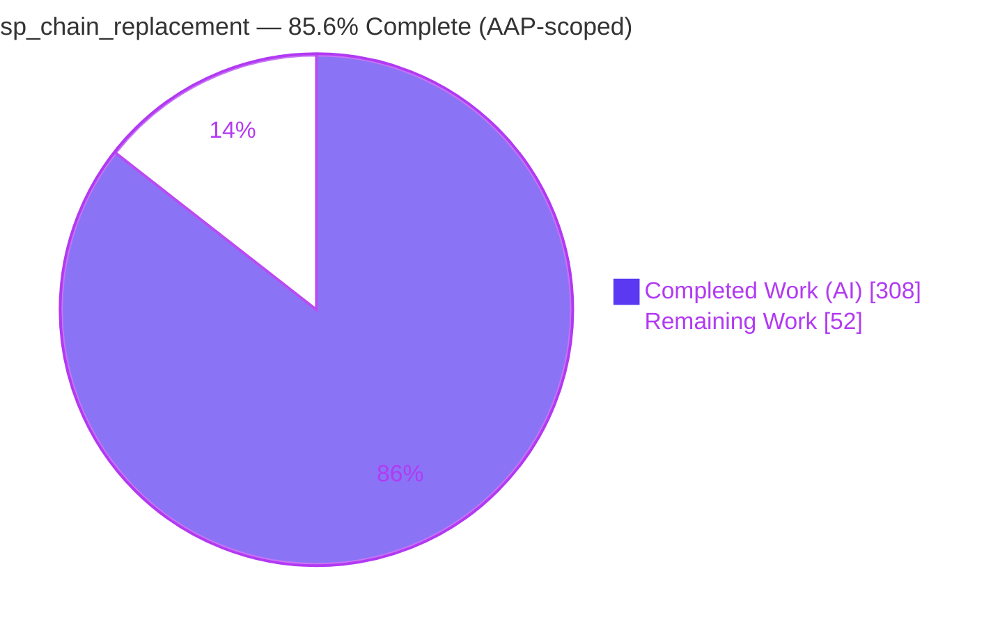
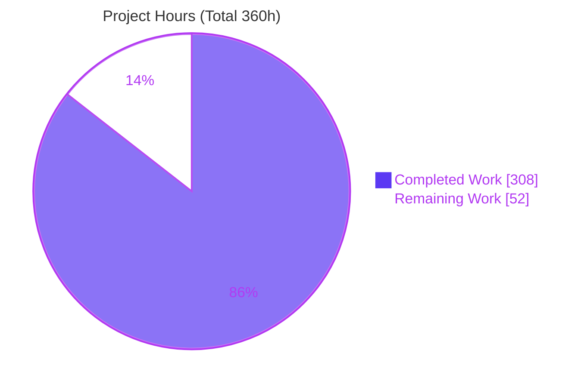
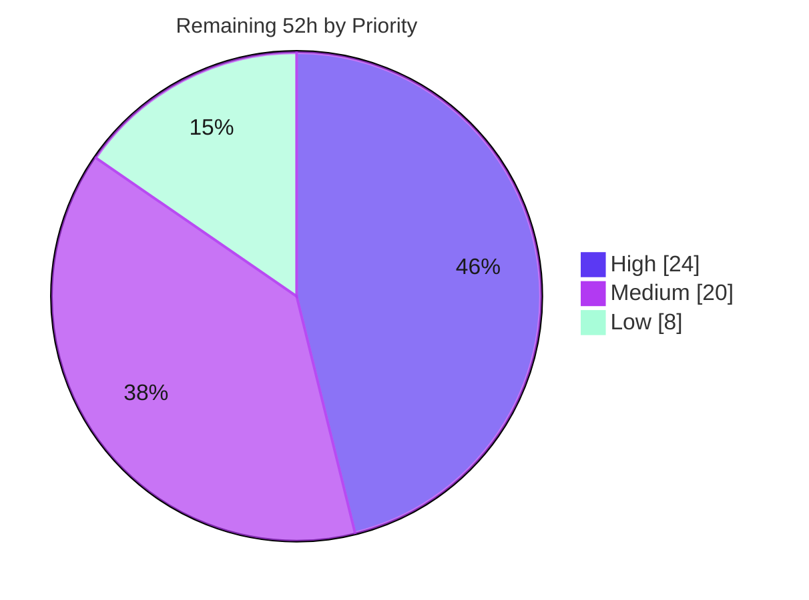

# Blitzy Project Guide — `sp_chain_replacement` Delta Lake on AWS Glue ETL Pipeline

> Repository: **delta-io/delta** monorepo · Branch: `blitzy-10c284ae-ed37-4df6-af88-3d79eaf8789a`
> Feature: Net-new, purely-additive AWS Glue 4.0 / PySpark + Delta Lake pipeline replacing a legacy Informatica/SQL Server stored-procedure chain.

---

## 1. Executive Summary

### 1.1 Project Overview

This project delivers a net-new, configuration-driven, multi-stage **AWS Glue 4.0 (PySpark / Spark 3.3.x)** ETL pipeline that writes to **Delta Lake** tables on Amazon S3 with full ACID guarantees via the `io.delta.storage.S3DynamoDBLogStore`, replacing a legacy Informatica-orchestrated SQL Server stored-procedure chain on a strict **1:1 functional-parity** basis (≥ 99.99% row-count + 5-field hash). It targets the platform/data-engineering team operating the `finance` domain. Per the **Minimal Change Mandate**, the feature is entirely additive — zero existing monorepo files are modified; all deliverables are net-new across eight directories (`jobs/`, `lib/`, `schemas/`, `dags/`, `config/`, `infra/`, `validate/`, `artifacts/`), orchestrated by one MWAA DAG and provisioned exclusively via Terraform.

### 1.2 Completion Status

The completion percentage is computed using the AAP-scoped hours methodology: `Completed ÷ (Completed + Remaining)`. The entire autonomous code build is complete and internally validated; the remaining work is path-to-production (live AWS deployment, gate execution against real data, and resolution of three documented open items).



| Metric | Value |
|---|---|
| **Total Hours** | **360 h** |
| **Completed Hours (AI + Manual)** | **308 h** (AI: 308 h · Manual: 0 h) |
| **Remaining Hours** | **52 h** |
| **Percent Complete** | **85.6 %** |

> Color key: **Completed = Dark Blue `#5B39F3`** · **Remaining = White `#FFFFFF`**.

### 1.3 Key Accomplishments

- ✅ **All 46 in-scope files created and committed** across the 8 feature directories (10,111 insertions, 0 deletions) over 33 autonomous commits — Minimal Change Mandate verified at the git level.
- ✅ **ACID Spark wiring complete** — `lib/spark_session.py` sets all six canonical properties (`spark.sql.extensions`, `spark.sql.catalog.spark_catalog`, and both `spark.delta.logStore.s3.impl` + `s3a.impl` = `io.delta.storage.S3DynamoDBLogStore`, plus DynamoDB table/region).
- ✅ **Live local Spark + Delta smoke test passed 11/11 steps** — session build, explicit `StructType` enforcement, overwrite round-trip, idempotent overwrite, merge upsert + merge idempotency, bad-record routing, and `BadRecordThresholdExceeded` fail-fast.
- ✅ **1:1 stored-procedure mapping** — manifest drives 5 stages (ingest + 3 SP transforms + output) and 6 tables (4 staging `overwrite`, `fact_general_ledger` merge, `dim_account_snapshot` overwrite); 80/80 consistency checks passed.
- ✅ **Terraform configuration valid** — `terraform fmt -check` and `terraform validate` pass; least-privilege IAM with zero wildcard resources; all five mandatory tags present on taggable resources.
- ✅ **MWAA DAG verified** — imports cleanly as `sp_chain_replacement` (cron `0 6 * * *`), 5 sequential `GlueJobOperator` tasks named exactly `{env}-{domain}-{pipeline_name}-{step}`.
- ✅ **Delta 2.3.0 artifacts staged** (the `delta-core_2.12` connector JAR + the `delta-storage-s3-dynamodb` LogStore JAR + the transitive `delta-storage` base JAR + Python wheel) with byte-for-byte SHA-256 checksums and Maven `.sha1` reconciliation for Terraform-driven upload.

### 1.4 Critical Unresolved Issues

| Issue | Impact | Owner | ETA |
|---|---|---|---|
| Gate 1 parity unverified against legacy baseline | 1:1 SP-translation errors would surface only here; blocks production acceptance | Data Eng | After dev deploy + baseline load |
| Legacy SQL Server parity baseline extract not yet available | Hard prerequisite — blocks Gate 1 | Client / Data team | Before Gate 1 |
| No live AWS deployment performed | Glue/DynamoDB/MWAA/CloudWatch integration untested end-to-end | DevOps / Platform | Sprint 1 of handoff |
| Informatica SLA value absent (Gate 6) | Performance gate cannot close before prod | Client / Platform | Before prod cutover (non-blocking now) |

### 1.5 Access Issues

| System / Resource | Type of Access | Issue Description | Resolution Status | Owner |
|---|---|---|---|---|
| AWS account (Glue, S3, DynamoDB, IAM, CloudWatch) | Deploy credentials | No live AWS credentials in the validation environment; all AWS-side validation is deferred | Open | DevOps / Platform |
| Terraform remote-state backend (S3) | Backend bucket | `infra/envs/<env>-backend.hcl` references a state bucket that must pre-exist before `terraform init` | Open | Platform |
| Pre-provisioned MWAA environment + S3 buckets | Resource existence | Assumed pre-provisioned per AAP; names/ARNs must be confirmed against `*.tfvars` | Open | Platform |
| Legacy SQL Server parity baseline | Data extract | Client-supplied sampled extract for Gate 1 not yet delivered to `PARITY_BASELINE_ROOT` | Open | Client / Data team |

### 1.6 Recommended Next Steps

> The Delta ↔ Glue Spark-version compatibility item (formerly AAP §0.3.3) is **resolved**: Glue 4.0 (Spark 3.3.x) pairs with `delta-spark 2.3.0` (connector Maven `io.delta:delta-core_2.12:2.3.0`), verified via the official Delta compatibility matrix, the `delta-spark==2.3.0` wheel metadata (`Requires-Dist: pyspark (<3.4.0,>=3.3.0)`), and an 11/11 local Spark 3.3.4 smoke test.

1. **[High]** Provision AWS prerequisites (credentials, Terraform state backend) and run `terraform apply` to the **dev** environment.
2. **[High]** Acquire and load the legacy parity baseline, then execute **Gate 1** (`pytest validate/test_parity.py --env dev`) and reconcile any mismatches.
3. **[Medium]** Promote to **nonprod/prod**, deploy the DAG to MWAA, run end-to-end, and close **Gates 2–5** against the live environment.
4. **[Low]** Obtain the Informatica SLA, benchmark wall-clock to close **Gate 6**, and confirm the MWAA-naming and secrets-management open questions.

---

## 2. Project Hours Breakdown

### 2.1 Completed Work Detail

All completed work was performed autonomously by Blitzy agents (0 human/manual hours). Each component traces to an AAP §0.5.1 deliverable group.

| Component | Hours | Description |
|---|---:|---|
| Shared library (`lib/`) | 70 | `spark_session` (6 ACID props), `manifest`, `schema_validation`, `delta_io`, `s3_paths`, `source_contract`, `logging_utils`, `job_args` — 2,472 LOC |
| Glue job stages (`jobs/`) | 80 | Stage 0 ingest+quarantine+threshold; Stages 1–3 1:1 SP transforms; Stage N merge/overwrite — 2,499 LOC |
| Explicit schemas (`schemas/`) | 16 | Explicit `StructType` definitions for all 6 tables — 805 LOC |
| Pipeline configuration (`config/`) | 12 | `pipeline_manifest.yaml` (SP→job map, write modes, parity blocks) + source contract — 290 LOC |
| MWAA orchestration DAG (`dags/`) | 10 | One DAG, 5 sequential `GlueJobOperator` tasks — 288 LOC |
| Terraform infrastructure (`infra/`) | 42 | Glue/IAM/DynamoDB/S3 objects/providers/variables/locals/outputs/versions + tfvars + backend — 1,991 LOC |
| Parity & security harness (`validate/`) | 30 | Gate 1 parity + Gate 5 security tests, reconciliation, conftest/fixtures — 1,552 LOC |
| Staged Delta artifacts (`artifacts/`) | 6 | Real Delta 2.3.0 binaries (`delta-core_2.12` connector JAR + `delta-storage-s3-dynamodb` LogStore JAR + transitive `delta-storage` JAR + wheel) + provenance/checksum README |
| Integration & multi-checkpoint review/QA remediation | 24 | CP1/CP2/final-checkpoint findings, QA INC-2 (signed_amount), QA FINAL_ALT (Stage 3 regrain), dep-pin & JAR-count reconciliation |
| Blitzy autonomous validation | 10 | Live Spark+Delta smoke (11/11), 80 consistency checks, compile/import/lint/terraform validate |
| Delta ↔ Glue Spark-version compatibility resolution (Refine PR) | 8 | Verified `delta-spark 2.3.0` ↔ Spark 3.3.x via docs.delta.io matrix + wheel metadata; restaged real 2.3.0 binaries; rebuilt `.venv` (pyspark 3.3.4); 11/11 smoke re-passed |
| **Total Completed** | **308** | |

### 2.2 Remaining Work Detail

All remaining work is path-to-production; none represents an in-scope code defect (validator found zero).

| Category | Hours | Priority |
|---|---:|---|
| AWS account prep, credentials & Terraform state backend provisioning | 4 | High |
| Terraform apply to DEV environment | 4 | High |
| Legacy SQL Server parity baseline extract acquisition & load | 6 | High |
| Gate 1 parity execution & mismatch investigation | 10 | High |
| Terraform apply to NONPROD + PROD + Gate 4 drift/tag verification | 6 | Medium |
| MWAA DAG deployment + live end-to-end run | 6 | Medium |
| Gate 2 ACID CloudWatch metric capture | 3 | Medium |
| Gate 3 idempotency verification on deployed env | 3 | Medium |
| Gate 5 live IAM `simulate-principal-policy` execution | 2 | Medium |
| Gate 6 performance benchmark + obtain Informatica SLA | 6 | Low |
| Confirm open questions (MWAA naming, secrets management) | 2 | Low |
| **Total Remaining** | **52** | |

> **Priority subtotals:** High = 24 h · Medium = 20 h · Low = 8 h → **52 h**.

### 2.3 Hours Reconciliation

| Reconciliation Check | Value |
|---|---|
| Section 2.1 Completed | 308 h |
| Section 2.2 Remaining | 52 h |
| **2.1 + 2.2 = Total (Section 1.2)** | **360 h** ✓ |
| Completion = 308 ÷ 360 | **85.6 %** ✓ |

---

## 3. Test Results

All entries below originate from Blitzy's autonomous validation logs for this project and were independently re-confirmed during this assessment. Traditional line-coverage instrumentation was not used — by design there are no local-only unit tests; the runnable logic was validated via a live Spark+Delta smoke test plus consistency checks (coverage shown as N/A accordingly).

| Test Category | Framework | Total | Passed | Failed | Coverage % | Notes |
|---|---|---:|---:|---:|---:|---|
| Parity acceptance (Gate 1) | pytest | 6 | 0 | 0 | N/A | **6 skipped by design** — AWS-integration tests require a deployed env |
| Security acceptance (Gate 5) | pytest | 2 | 0 | 0 | N/A | **2 skipped by design** — require live IAM/deployed policy |
| Runtime smoke (Spark + Delta) | pyspark 3.3.4 + delta-spark 2.3.0 | 11 | 11 | 0 | N/A | Session/props/StructType/overwrite/merge/idempotency/bad-record fail-fast |
| Config consistency | custom harness | 80 | 80 | 0 | N/A | manifest ↔ schemas ↔ jobs ↔ write-modes ↔ parity blocks |
| Compilation | `compileall` (`-W error::SyntaxWarning`) | 23 | 23 | 0 | N/A | All in-scope `.py` files |
| Module import | python import | 18 | 18 | 0 | N/A | `lib.*`, `schemas.*`, `validate.*`, `jobs.*` |
| IaC validation | terraform fmt + validate | 2 | 2 | 0 | N/A | `fmt -check -recursive` + `validate` → "Success!" |
| Static lint | AST pyflakes-equivalent (`--no-fix`) | 23 | 23 | 0 | N/A | 0 problems |
| DAG import | apache-airflow 2.11.2 | 1 | 1 | 0 | N/A | `dag_id=sp_chain_replacement`, 5 tasks, naming verified |
| **Totals** | | **166** | **158** | **0** | — | **8 skipped by design; 0 failures, 0 errors** |

**Pass rate (executed):** 158 / 158 = **100%**. **Skipped by design:** 8 (AWS-integration acceptance tests). **Failures/errors:** 0.

---

## 4. Runtime Validation & UI Verification

**UI Verification:** **Not applicable** — this is a headless, server-side data-engineering pipeline (AAP §0.5.3). Operator interaction is via the Airflow scheduler/trigger and CloudWatch logs only; there is no UI, component library, or design-system surface.

**Runtime health (local validation environment):**

- ✅ **Operational** — `build_spark_session` (local[*]) constructs a session with all 6 canonical Delta/LogStore properties set exactly.
- ✅ **Operational** — Explicit `STAGING_RAW` `StructType` honored (no schema inference).
- ✅ **Operational** — Delta `overwrite` write + read round-trip (names/types preserved; read-time nullable relaxation is expected Parquet behavior).
- ✅ **Operational** — Idempotent `overwrite` re-run (row count constant).
- ✅ **Operational** — `merge` upsert (update + insert) and merge idempotency (no row growth) — confirms Gate 3 structural idempotency.
- ✅ **Operational** — `schema_validation` good/bad split + `validate_and_quarantine` routing; `BadRecordThresholdExceeded` raised at threshold 0.0 (ACID-strict fail-fast, no fallback).
- ✅ **Operational** — MWAA DAG imports cleanly; 5 `GlueJobOperator` tasks chained sequentially; task IDs match the mandated naming convention.
- ✅ **Operational** — Terraform plan-time `console` resolves `local.common_tags` (5 tags), 5 manifest stages (1:1 with jobs), and staged JAR URIs → manifest-driven `for_each` yields exactly 5 `aws_glue_job`.

**Pending live-AWS validation (deferred — no live account):**

- ⚠ **Partial** — DynamoDB conditional-write coordination bypassed locally (`file://`); real multi-cluster ACID path unverified (**Gate 2**).
- ⚠ **Partial** — Gate 1 parity (≥ 99.99%) requires deployed tables + legacy baseline.
- ⚠ **Partial** — Gate 5 live `aws iam simulate-principal-policy` requires the deployed policy.
- ⚠ **Partial** — End-to-end Glue/MWAA/S3/CloudWatch run not yet exercised on live services.

---

## 5. Compliance & Quality Review

Cross-mapping of AAP mandates and validation gates to status. "Static PASS" = verified in code/config; live confirmation is a path-to-production task.

| Deliverable / Mandate | Benchmark | Status | Progress |
|---|---|---|---|
| Minimal Change Mandate | Zero existing files modified | ✅ Pass | 46 net-new files, 0 deletions |
| Runtime version pin | Glue 4.0 (Spark 3.3.x, Python 3.10) | ✅ Pass | `glue_version="4.0"`, `python_version="3"` hardcoded |
| LogStore enforcement | `S3DynamoDBLogStore` only (s3 + s3a) | ✅ Pass | Both impl keys set; no other LogStore |
| Spark wiring | 6 canonical props (ext + catalog + 2 logstore + ddb) | ✅ Pass | Verified in smoke test |
| Schema safety | Explicit `StructType`, `mergeSchema=false` | ✅ Pass | `inferSchema`/`mergeSchema` = false; 80/80 consistency |
| 1:1 SP→job mapping | One job per stored procedure | ✅ Pass | 4 SPs → stages 1–3 + output; manifest-driven |
| Least-privilege IAM (Gate 5) | No `*` resource ARNs | ✅ Pass (static) | Zero bare wildcards; live `simulate-principal-policy` pending |
| Mandatory tagging (Gate 4) | 5 tags on every resource | ✅ Pass (static) | All 5 tags incl. `ManagedBy="terraform"`; plan-zero-change pending apply |
| Artifact sourcing | Exclusively from `ARTIFACT_S3_BUCKET` | ✅ Pass | JARs+wheel staged; checksums verified; no public PyPI/Maven at runtime |
| ACID strictness (Gate 2) | Conditional-write failure → non-zero exit | ✅ Pass (fail-fast) | Verified locally; CloudWatch metric capture pending deploy |
| Six-field CloudWatch event | job/run/in/out/bad/elapsed | ✅ Pass | All 6 fields present in `logging_utils.py` |
| Idempotency (Gate 3) | Re-run does not grow row count | ✅ Pass (structural) | Overwrite + merge verified locally; full run pending deploy |
| Parity ≥ 99.99% (Gate 1) | Row-count + 5-field hash, 100% of tables | ⏳ Pending | Harness complete; needs deployed tables + baseline |
| Performance (Gate 6) | ≤ 2× Informatica SLA | ⏳ Pending | Non-blocking until prod; needs SLA value |
| Infrastructure validity | `terraform validate` | ✅ Pass | "Success! The configuration is valid." |

**Fixes applied during autonomous validation:** CHECKPOINT 1 schema/manifest reconciliation; CP2 SP-replacement parity & S3 path-safety findings; QA INC-2 (`signed_amount` reconciliation note); final-checkpoint review findings; QA FINAL_ALT (Stage 3 regrain to account × date); dependency-pin relaxation to lower-bound floors per AAP §0.3.1; staged-JAR count reconciliation (2 → 3, adding the transitive `delta-storage-2.3.0.jar`).

**Outstanding (path-to-production):** Gate 1 parity, Gate 2 ACID metric, Gate 3 full idempotency, Gate 5 live security, Gate 6 performance — all require a deployed environment and/or client inputs.

---

## 6. Risk Assessment

| # | Risk | Category | Severity | Probability | Mitigation | Status |
|---|---|---|---|---|---|---|
| T1 | Delta ↔ Glue Spark-version pairing (Glue 4.0 ships Spark 3.3.x) | Technical | High | — | **Resolved:** selected `delta-spark 2.3.0` (connector `io.delta:delta-core_2.12:2.3.0`) for Spark 3.3.x — verified via docs.delta.io matrix + `delta-spark==2.3.0` wheel metadata (`pyspark <3.4,>=3.3`) + 11/11 local Spark 3.3.4 smoke; artifacts/config/docs restaged to 2.3.0 (AAP §0.3.3 closed) | Resolved |
| T2 | 1:1 SP→PySpark parity logic unverified vs real data | Technical | High | Medium | Run Gate 1 with legacy baseline; investigate mismatches | Open |
| T3 | Delta read-time nullable relaxation vs strict schema equality | Technical | Low | Low | Expected Parquet behavior; reconciliation accounts for it | Mitigated |
| T4 | Stage 3 account×date regrain (recent QA fix) grain subtlety | Technical | Medium | Low | Documented in manifest; verify at Gate 1 | Mitigated / verify |
| S1 | IAM least-privilege only statically verified | Security | Medium | Low | Run Gate 5 `simulate-principal-policy` post-deploy | Open (static pass) |
| S2 | Secrets management approach unconfirmed | Security | Medium | Medium | Confirm SSM / Secrets Manager / role assumption; no secrets in code/tfvars | Open |
| S3 | Artifact supply-chain provenance | Security | Low | Low | Checksums verified byte-for-byte; confirm upstream provenance | Mitigated |
| O1 | Terraform never applied; first apply may hit provider/permission/quota | Operational | Medium | Medium | Apply to dev first; AWS prereqs checklist; backend bucket must pre-exist | Open |
| O2 | Gate 6 performance unmeasured; Informatica SLA absent | Operational | Medium | Medium | Obtain SLA; benchmark; non-blocking until prod cutover | Open (non-blocking) |
| O3 | CloudWatch emission + Gate 2 ACID metric pending deploy | Operational | Low | Low | Capture on first deployed run | Open |
| O4 | MWAA DAG only import-checked; live scheduler unverified | Operational | Medium | Low | Deploy to MWAA bucket; verify in Airflow UI | Open |
| I1 | Full AWS integration untested end-to-end on live services | Integration | High | Medium | Staged dev → nonprod → prod deploy + e2e run | Open |
| I2 | Parity baseline extract (client-supplied) not yet available | Integration | High | Medium | Coordinate client/data team to extract + load `PARITY_BASELINE_ROOT` | Open |
| I3 | DynamoDB conditional-write coordination bypassed locally | Integration | Medium | Low | Verify via Gate 2 on deployed env | Open |
| I4 | Pre-provisioned prereqs (MWAA env, buckets) assumed | Integration | Medium | Low | Confirm exist + named per tfvars before apply | Open |

**Risk summary:** Of the four originally High-severity risks, the Spark-version tension (T1) is now **resolved** (Delta 2.3.0 on Glue 4.0 Spark 3.3.x). Three High-severity risks remain on the critical path — parity-logic verification (T2), live-AWS integration (I1), and baseline availability (I2). All remaining items are path-to-production, not code defects.

---

## 7. Visual Project Status

**Project hours breakdown** (Completed = Dark Blue `#5B39F3`, Remaining = White `#FFFFFF`):



**Remaining work by priority** (sums to the 52 h Remaining in Sections 1.2 and 2.2):



**Remaining hours per category (Section 2.2):**

| Category | Hours | Bar |
|---|---:|---|
| Gate 1 parity execution & investigation | 10 | ██████████ |
| Parity baseline acquisition & load | 6 | ██████ |
| Terraform apply nonprod + prod + Gate 4 | 6 | ██████ |
| MWAA DAG deploy + end-to-end run | 6 | ██████ |
| Gate 6 performance + Informatica SLA | 6 | ██████ |
| AWS account prep + state backend | 4 | ████ |
| Terraform apply to dev | 4 | ████ |
| Gate 2 ACID CloudWatch capture | 3 | ███ |
| Gate 3 idempotency on deployed env | 3 | ███ |
| Gate 5 live IAM simulate-principal-policy | 2 | ██ |
| Open questions (MWAA naming, secrets) | 2 | ██ |
| **Total** | **52** | |

---

## 8. Summary & Recommendations

**Achievements.** The `sp_chain_replacement` pipeline is **85.6% complete** on an AAP-scoped basis (308 of 360 hours). Every AAP §0.5.1 deliverable — 46 files spanning Glue jobs, the shared ACID library, explicit schemas, the MWAA DAG, the config manifest, Terraform IaC, the parity/security harness, and staged Delta artifacts — is implemented, compiles, imports, and passes a live local Spark + Delta smoke test (11/11) and 80/80 config-consistency checks. The Minimal Change Mandate is fully respected (0 existing files touched), and the code already passed several internal review/QA checkpoints.

**Remaining gaps (the 52 hours).** What remains is entirely **path-to-production**: there has been no live AWS deployment, so the acceptance gates that depend on a deployed environment and real data (Gate 1 parity, Gate 2 ACID metrics, Gate 3 full idempotency, Gate 5 live IAM simulation, Gate 6 performance) are not yet closed, and three open items remain (MWAA task-naming confirmation, secrets-management approach, and the Informatica SLA for Gate 6). The **Delta ↔ Glue Spark-version compatibility item is resolved** (Delta 2.3.0 on Glue 4.0 Spark 3.3.x).

**Critical path to production.** With the Spark-version compatibility item resolved (Delta 2.3.0 on Glue 4.0 Spark 3.3.x): (1) provision AWS prerequisites and `terraform apply` to dev; (2) load the legacy baseline and pass Gate 1 parity; (3) promote to nonprod/prod, deploy the DAG, and close Gates 2–5; (4) obtain the Informatica SLA and close Gate 6.

**Success metrics.** Production readiness is achieved when all six gates pass in the target environment with parity ≥ 99.99% for 100% of tables and `terraform plan` reports zero drift.

**Production readiness assessment.** **Not production-ready yet**, but the code base is in a strong, validated state. With a live AWS account, the parity baseline, and the SLA, the estimated **52 hours** of remaining effort is well-scoped and low-ambiguity; the Delta ↔ Glue version-compatibility item that previously carried the most upside risk is now resolved (Delta 2.3.0 on Spark 3.3.x).

| Metric | Value |
|---|---|
| AAP-scoped completion | 85.6% |
| Code defects found (in scope) | 0 |
| Gates passing (static/local) | 4 of 6 (G2, G3 structural, G4, G5 static) |
| Gates pending live deploy | G1, G6 (+ live confirmation of G2/G3/G5) |
| Estimated remaining effort | 52 h |

---

## 9. Development Guide

### 9.1 System Prerequisites

**Local validation environment (verified):**
- **Java 17** (`JAVA_HOME=/usr/lib/jvm/java-17-openjdk-amd64`) — required by the PySpark/Delta JVM.
- **Python 3.10** (validated on 3.10.20) — matches the Glue 4.0 Python 3.10 runtime.
- **Terraform v1.15.6** — with `hashicorp/aws` `~> 5.0` (5.100.0) and `hashicorp/archive` 2.8.0.

**Production runtime prerequisites (AWS-side):**
- AWS Glue 4.0; a pre-provisioned MWAA environment; S3 buckets (`DELTA_S3_BUCKET`, `ARTIFACT_S3_BUCKET`, `MWAA_DAG_S3_BUCKET`, source); DynamoDB (created by this feature); IAM; CloudWatch.
- AWS CLI + deployment credentials; a pre-existing S3 bucket for Terraform remote state.

### 9.2 Environment Setup

```bash
# From the repository root. Sets JAVA_HOME/PATH, activates .venv, exports PySpark vars.
source /tmp/feature_env.sh
export PYTHONPATH="$(pwd)"
```

To recreate the test virtualenv from scratch:

```bash
python3.10 -m venv .venv
source .venv/bin/activate
# delta-spark==2.3.0 resolves from the local artifacts/ wheel (no public PyPI required at runtime)
pip install -r validate/requirements.txt
```

### 9.3 Dependency Installation (Production / Glue)

Dependencies are **not** resolved from public repositories at runtime. Terraform uploads the staged binaries to `ARTIFACT_S3_BUCKET`, and each Glue job references them:

```text
--extra-jars               s3://<ARTIFACT_S3_BUCKET>/.../delta-core_2.12-2.3.0.jar,
                           s3://<ARTIFACT_S3_BUCKET>/.../delta-storage-s3-dynamodb-2.3.0.jar,
                           s3://<ARTIFACT_S3_BUCKET>/.../delta-storage-2.3.0.jar
--additional-python-modules  delta-spark==2.3.0   (wheel resolved from ARTIFACT_S3_BUCKET)
```

### 9.4 Local Verification (all commands tested — exit 0)

```bash
# 1) Compile all in-scope Python
./.venv/bin/python -m compileall -q jobs lib schemas validate dags          # exit 0

# 2) Run the acceptance harness (8 AWS-integration tests skip by design)
./.venv/bin/python -m pytest validate/ --env dev -q                          # "8 skipped", exit 0

# 3) Terraform formatting + validation
cd infra && terraform fmt -check -recursive && terraform validate            # "Success!", exit 0
cd ..

# 4) Verify the MWAA DAG imports and wiring
PIPELINE_ENV=dev PIPELINE_MANIFEST_PATH="$(pwd)/config/pipeline_manifest.yaml" \
  PYTHONPATH="$(pwd)" ./.venv-airflow/bin/python -c "import dags.sp_chain_replacement_dag"
# -> dag_id=sp_chain_replacement, schedule "0 6 * * *", 5 tasks
```

### 9.5 Deployment & Startup Sequence (AWS — path-to-production)

```bash
cd infra
# Initialize with the per-environment remote backend
terraform init -backend-config=envs/dev-backend.hcl
# Review and apply (uploads JARs+wheel to ARTIFACT_S3_BUCKET, DAG to MWAA_DAG_S3_BUCKET,
# creates DynamoDB coordination table, Glue jobs, least-privilege IAM role/policy)
terraform plan  -var-file=envs/dev.tfvars
terraform apply -var-file=envs/dev.tfvars
```

Then trigger the MWAA DAG `sp_chain_replacement` (daily `0 6 * * *` cron, or manually with `run_date` / `source_s3_path` via `conf`). The five tasks run strictly sequentially: ingest → cleanse → enrich → balances → output.

### 9.6 Acceptance / Gate Verification

```bash
# Gate 1 (parity) + Gate 5 (security) — require a deployed env and the parity baseline
pytest validate/test_parity.py --env dev
```

Required environment variables for the gates: `AWS_REGION`, `DELTA_S3_BUCKET`, `DELTA_DDB_TABLE_NAME`, `GLUE_ROLE_*`, `PARITY_BASELINE_ROOT`, `IAM_POLICY_JSON_PATH`.

### 9.7 Troubleshooting

- **`8 skipped` in pytest** — expected locally; the parity/security tests are AWS-integration tests that gracefully skip when the deployment env vars are absent.
- **`terraform init` backend error** — the S3 state bucket referenced in `envs/<env>-backend.hcl` must pre-exist.
- **Spark/Delta version errors on Glue** — the Glue 4.0 (Spark 3.3.x) compatible pairing is `delta-spark 2.3.0` + `pyspark 3.3.x` (connector Maven `io.delta:delta-core_2.12:2.3.0`); this is **resolved** (AAP §0.3.3). If such errors appear, confirm the staged artifacts are the 2.3.0 set (not 3.2.0).
- **DAG import errors** — ensure `PIPELINE_ENV` and `PIPELINE_MANIFEST_PATH` are set and `PYTHONPATH` includes the repo root.

---

## 10. Appendices

### Appendix A — Command Reference

| Command | Purpose |
|---|---|
| `source /tmp/feature_env.sh` | Activate the validated local environment |
| `./.venv/bin/python -m compileall -q jobs lib schemas validate dags` | Compile all in-scope Python |
| `./.venv/bin/python -m pytest validate/ --env dev -q` | Run acceptance harness (skips without AWS) |
| `terraform fmt -check -recursive` | Verify Terraform formatting |
| `terraform validate` | Validate Terraform configuration |
| `terraform init -backend-config=envs/<env>-backend.hcl` | Initialize per-env remote backend |
| `terraform apply -var-file=envs/<env>.tfvars` | Provision AWS resources |
| `pytest validate/test_parity.py --env <env>` | Gate 1 (parity) + Gate 5 (security) |

### Appendix B — Port Reference

| Service | Port | Notes |
|---|---|---|
| (none locally) | — | Headless pipeline; no local network services. Runtime services (Glue, MWAA, DynamoDB, S3, CloudWatch) are AWS-managed and accessed via SDK/HTTPS endpoints. |

### Appendix C — Key File Locations

| Path | Purpose |
|---|---|
| `config/pipeline_manifest.yaml` | Authoritative SP→job map, stage order, write modes, parity blocks |
| `config/sp_chain_replacement_source_contract.yaml` | Stage 0 source contract (delimiter/quote/null/header/encoding/columns) |
| `lib/spark_session.py` | ACID `SparkSession` builder (6 canonical properties) |
| `lib/schema_validation.py` | `StructType` conformance + bad-record routing/count |
| `jobs/stage_0_ingest.py` … `jobs/stage_n_output.py` | The 5 Glue stage entrypoints |
| `schemas/` | Explicit `StructType` definitions for all 6 tables |
| `dags/sp_chain_replacement_dag.py` | MWAA DAG (5 sequential `GlueJobOperator` tasks) |
| `infra/*.tf` + `infra/envs/*` | Terraform config, per-env tfvars, backend HCL |
| `validate/test_parity.py` | Gate 1 (parity) + Gate 5 (security) acceptance tests |
| `artifacts/` | Staged Delta 2.3.0 JARs + wheel + provenance README |

### Appendix D — Technology Versions

| Component | Version | Source |
|---|---|---|
| AWS Glue | 4.0 (Spark 3.3.x, Python 3.10, Scala 2.12) | Authoritative (AAP) |
| `delta-spark` | 2.3.0 | Verified compatible with Glue 4.0 Spark 3.3.x (AAP §0.3.3 resolved); staged wheel |
| `io.delta:delta-core_2.12` | 2.3.0 | Staged connector JAR (Delta 2.x Maven artifact; renamed to `delta-spark_2.12` in Delta 3.0+) |
| `io.delta:delta-storage-s3-dynamodb` | 2.3.0 | Staged JAR (+ transitive `delta-storage-2.3.0.jar`) |
| Terraform | 1.15.6 | Local validation |
| `hashicorp/aws` provider | 5.100.0 (`~> 5.0`) | `.terraform.lock.hcl` |
| `hashicorp/archive` provider | 2.8.0 | `.terraform.lock.hcl` |
| pyspark (local test) | 3.3.4 | `.venv` (Spark 3.3.x line; matches Glue 4.0 runtime) |
| apache-airflow (local DAG check) | 2.11.2 + providers-amazon 9.22.0 | `.venv-airflow` |
| Java | 17 (OpenJDK) | Local validation |

### Appendix E — Environment Variable Reference

| Variable | Used By | Purpose |
|---|---|---|
| `PIPELINE_ENV` | DAG, jobs | Environment selector (dev/nonprod/prod) |
| `PIPELINE_MANIFEST_PATH` | DAG, lib | Path to `pipeline_manifest.yaml` |
| `PYTHONPATH` | local tools | Must include repo root |
| `AWS_REGION` | jobs, validate | AWS region for Glue/DynamoDB/S3 |
| `DELTA_S3_BUCKET` | jobs | Root bucket for Delta tables |
| `ARTIFACT_S3_BUCKET` | infra/jobs | Source of JARs + wheel (no public PyPI/Maven) |
| `MWAA_DAG_S3_BUCKET` | infra | Target for DAG upload |
| `DELTA_DDB_TABLE_NAME` | jobs, validate | DynamoDB coordination table |
| `PIPELINE_SOURCE_S3_PREFIX` | jobs | Stage 0 source flat-file prefix |
| `BAD_RECORD_THRESHOLD` | jobs | Stage 0 fail threshold (default 0.0) |
| `PARITY_BASELINE_ROOT` | validate | Legacy baseline location (Gate 1) |
| `IAM_POLICY_JSON_PATH` | validate | IAM policy JSON for Gate 5 |
| `GLUE_ROLE_*` | validate | Glue execution role for security checks |

### Appendix F — Developer Tools Guide

| Tool | Role |
|---|---|
| `.venv` (Python 3.10.20) | Runs jobs/lib/schemas/validate; pyspark 3.3.4 + delta-spark 2.3.0 + boto3 + pytest + pyyaml |
| `.venv-airflow` (Python 3.10.20) | DAG import-check only; apache-airflow 2.11.2 + providers-amazon 9.22.0 |
| Terraform CLI 1.15.6 | IaC validate/plan/apply |
| `javap` | Verifies JAR class closure (`S3DynamoDBLogStore` + transitive storage JAR) |
| pytest | Gate 1 (parity) + Gate 5 (security) harness |

### Appendix G — Glossary

| Term | Definition |
|---|---|
| **AAP** | Agent Action Plan — the authoritative project requirements specification |
| **ACID** | Atomicity, Consistency, Isolation, Durability — guaranteed via `S3DynamoDBLogStore` |
| **S3DynamoDBLogStore** | Delta LogStore using DynamoDB for multi-cluster write coordination on S3 |
| **MWAA** | Amazon Managed Workflows for Apache Airflow |
| **Glue Job** | Serverless Spark job; one per pipeline stage |
| **Parity (Gate 1)** | Row-count + 5-field-hash match (≥ 99.99%) vs. the legacy SQL Server baseline |
| **Stored Procedure (SP)** | Legacy SQL Server logic unit, replaced 1:1 by a PySpark stage |
| **Staging table** | Intermediate Delta table (`overwrite` mode) |
| **Output table** | Final Delta table (`merge` or `overwrite` mode) |
| **Manifest** | `pipeline_manifest.yaml` — the single source of truth driving stages/tables |

---

*Generated by the Blitzy Platform — AAP-scoped completion analysis. All test results originate from Blitzy's autonomous validation logs for this project.*